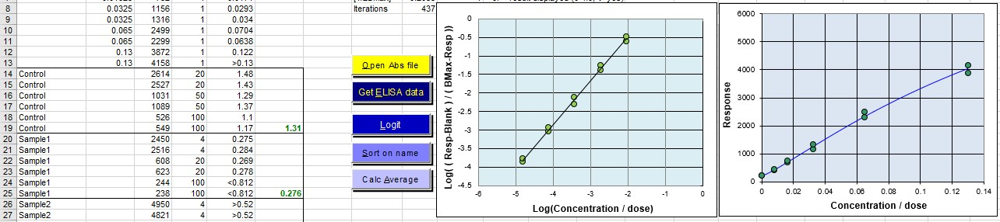
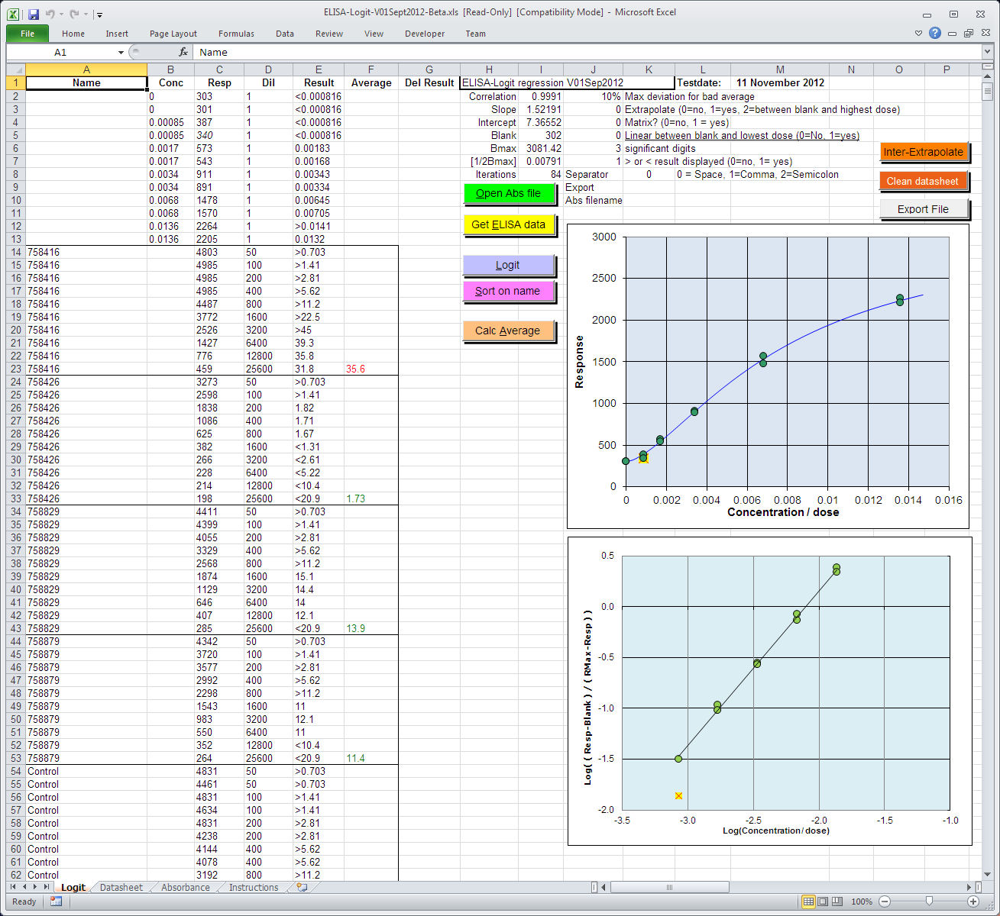
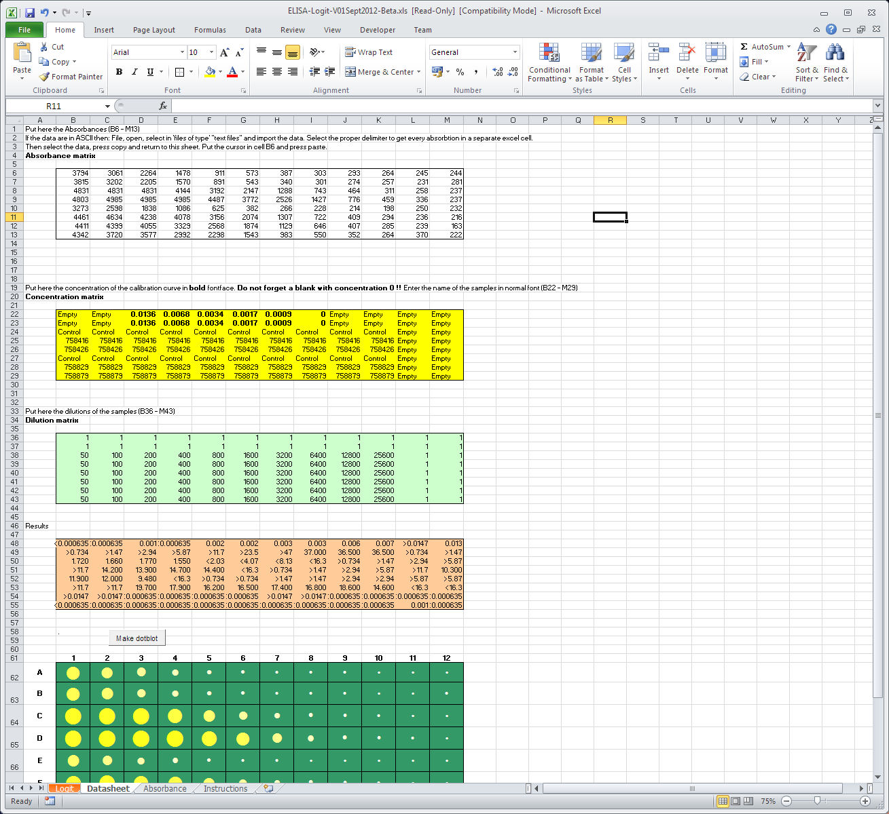

# A logit regression program in Microsoft Excel

[⬅ Back to calibration programs](../README.md)

The program can be used for fitting sigmoid, half-sigmoid curves and even straight lines.
This logit regression program in Excel is optimised to work with ELISA-data.
It is also very easy to use with lists like counts from radio immuno assays (RIA).
The ELISA-logit worksheet can be adapted to be used with a LIMS; it supports input and output files.

Read the instructions in the sheet "Instructions" in the XLS-worksheet.
Several options can be set:

- the number of significant digits in the result,
- warning limit when signaling VC% of end result is above limit,
- extrapolation options.

**Advise (rules of thumb):**

- Do not use more than 5 doses and a blank. (This logit needs a blank! (zero dose)).
- If you want to use more data points, invest in multiplos instead of more doses.
- The lowest response of the calibration line must be higher than 6-10 times the standard deviations of the noise in your blank.
- The highest response of your curves should be 10% higher in response than the second highest response.
- Do not copy, move and paste in the worksheet.
- If the program does not work properly use a new empty copy of it.

**Enable macro's to run the program!**

Several versions of the Logit program in an Excel-sheet are available.
The difference between version 2017 and 2018 is the calculation of the &lt;result and &gt;result.
In the 2017 and older versions the presentation of a &lt;result or &gt;result is based on the response (absorbance).
The 2018 version uses the values of the lowest and highest concentration of the calibration line.
Especially for validation purposes it is difficult to explain why lower and upper limits change with every test.

[These files on GitHub](https://github.com/ednieuw/ELISA-logit-regression)

## Downloads

| File | Description |
| --- | --- |
| [ELISA-Logit-V13aug2026](ELISA-Logit-V13aug2026.xlsm) | Latest version. ActiveX components removed |
| [Manual in Dutch and English](Manual%20ELISA-Logit-V01Jul2018%20in%20Microsoft%20Excel.docx) as DOCX | Also available [as PDF](Manual%20ELISA-Logit-V01Jul2018%20in%20Microsoft%20Excel.pdf) |
| [Handleiding_Logit_in_Excel.pdf](Handleiding_Logit_in_Excel.pdf) | Manual in Dutch |

### Older versions

| File | Description |
| --- | --- |
| [ELISA-Logit-V01Jul2018](OlderVersions/ELISA-Logit-V01Jul2018.xlsm) | Version with spline. &lt; and &gt; based on concentration of the calibration curve instead of response |
| [ELISA-logit21042005](OlderVersions/ELISA-Logit21042005.xls) | First validated program |
| [ELISA-Logit-V04apr2007](OlderVersions/ELISA-Logit-V04apr2007.xls) | V21042005 --&gt; V04apr2007 absorbance file input directly from two types of ELISA-readers |
| [ELISA-Logit-V25Oct2009](/OlderVersions/ELISA-Logit-V25Oct2009.xls) | V04apr2007 --&gt; V25Oct2009 Corrected some type errors in text |
| [ELISA-Logit-V01Sept2012-Beta](/OlderVersions/ELISA-Logit-V01Sept2012-Beta.xls) | Added logit log graph. Corrected minor issues |
| [ELISA-Logit-V03Feb2013_1.xls](/OlderVersions/ELISA-Logit-V03Feb2013_1.xls) | V03Feb2013_1. Small bug that data in matrix result are sorted after "Sort on name" |
| [ELISA-Logit-V24May2017.xlsm](/OlderVersions/ELISA-Logit-V24May2017.xlsm) | &lt; and &gt; results based on the average response |
| [ELISA-Logit-V08Dec2021](/OlderVersions/ELISA-Logit-V08Dec2021.xlsm) | Corrected bug in &lt; and &gt; in matrix results |
| [ELISA-Logit-V20Jul2022.xlsm](/OlderVersions/ELISA-Logit-V20Jul2022.xlsm) | v08Dec2022 without password protection on VBA (Copyright 2022) |

[Linearity.xlsx](Linearity.xlsx)

These programs can be used for non-profit purposes (Copyright 1998-2022)

[⬅ Back to calibration programs](../README.md)

---

 [Ed Nieuwenhuys](https://ednieuw.com/email.html)
