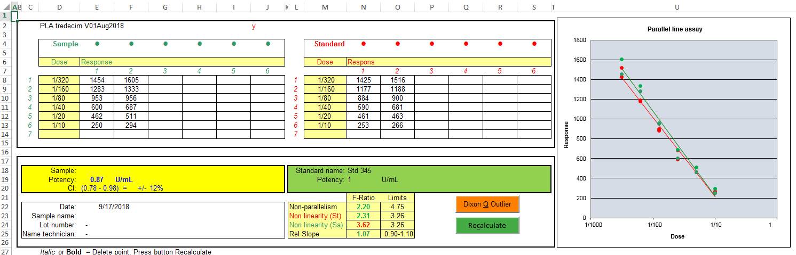
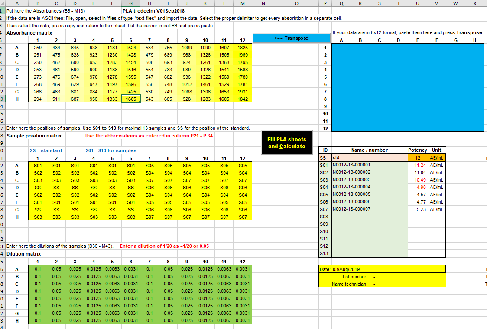
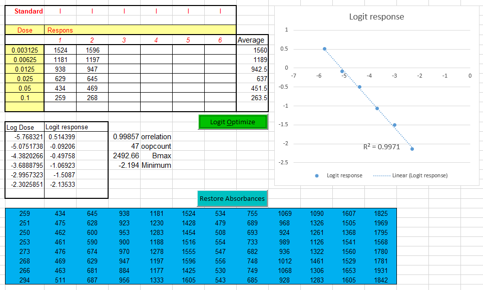
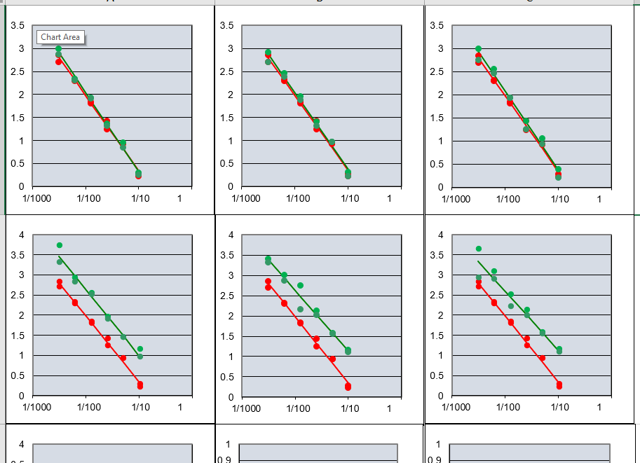

# Parallel line assay, PLA in Microsoft Excel

[⬅ Back to calibration programs](../README.md)

## English

This PLA (parallel line assay) calculation method is programmed in Microsoft Excel.

The program is designed to calculate up to thirteen potencies from data measured in a 8 by 12 ELISA format or from linear lists with data. Results are grouped per sample on thirteen separated sheets or grouped together in one sheet. Depending on the calculated statistics, results are flagged with a colour to identify results with statistical results out of specification.

The PLA calculation method followed was described by Finney and is designed for the so called dilution assays. The measured response of a dilution of a test sample is compared with the response of the same dilution of a standard. By means of analysis of variance a F-test is calculated and used to validate the calculated potency of the test sample.

## Nederlands

Deze PLA (parallel line assay) rekenmethode is in een Microsoft Excel-worksheet geprogrammeerd.

Deze applicatie leest ELISA-plaatbestanden in en vult, tot dertien monsters, per monster een PLA-tabblad met gegevens. De resultaten van deze dertien tabbladen worden gegroepeerd in een tabel en voorzien van een kleur, afhankelijk of de statistiek binnen of buiten specificaties valt.

Deze PLA-rekenmethode is beschreven door Finney en wordt toegepast in 'dilution assays'.
Bij deze bepalingen wordt de respons gemeten per verdunning van een testmonster en vergeleken met de respons van dezelfde verdunningen van de standaard. Door middel van een variantieanalyse wordt aan de hand van F-toetsen en betrouwbaarheid van de berekende potency de validiteit van het resultaat getoetst.

---

## Manual and downloads

| File | Description |
| --- | --- |
| [Manual PLA Tredecim V01Sep2018 in Excel (PDF)](Manual_PLA_Tredecim_V01Sep2018_in_Excel.pdf) | The manual in English and Dutch |
| [Manual PLA Tredecim V01Sep2018 in Excel (DOCX)](Manual_PLA_Tredecim_V01Sep2018_in_Excel.docx) | The same manual as Word document |
| [PLA tredecim V01Sep2018](PLA%20tredecim%20V01Sep2018.xlsm) | The program |
| [PLA tredecim V01Sep2018 test](PLA%20tredecim%20V01Sep2018_test.xlsm) | The program filled with data to play with |
| [PLA_V28Feb2009](PLA-V28Feb2009.zip) | The 2009 version, single sample program |

---

Raw data and results are grouped together.

With a logit transformation of the dose-responses of the standard it is possible to extend the measuring range or make sigmoid curves linear.

All thirteen graphs together in one sheet.

---

Reference: David J. Finney, *Statistical Method in Biological Assay*, Third edition 1978, [pag 69-104](Finney-PLA.pdf)

[⬅ Back to calibration programs](../README.md)

---

[Ed Nieuwenhuys](https://ednieuw.com/email.html), 10 mei 2022, 13 August 2019
