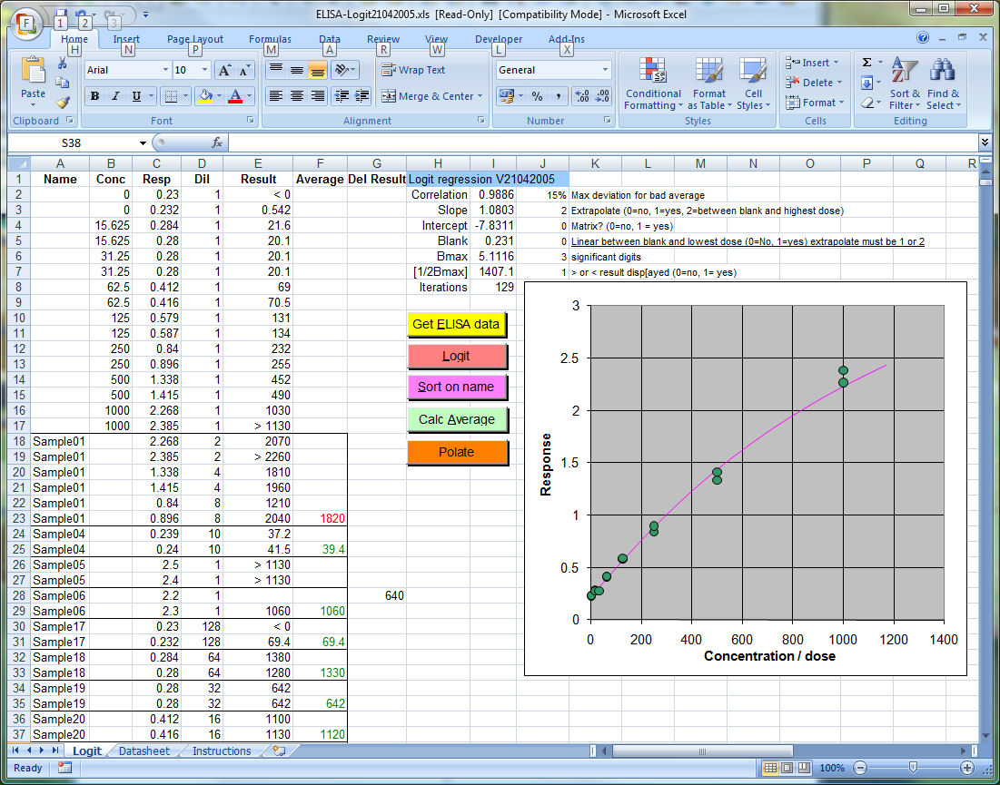
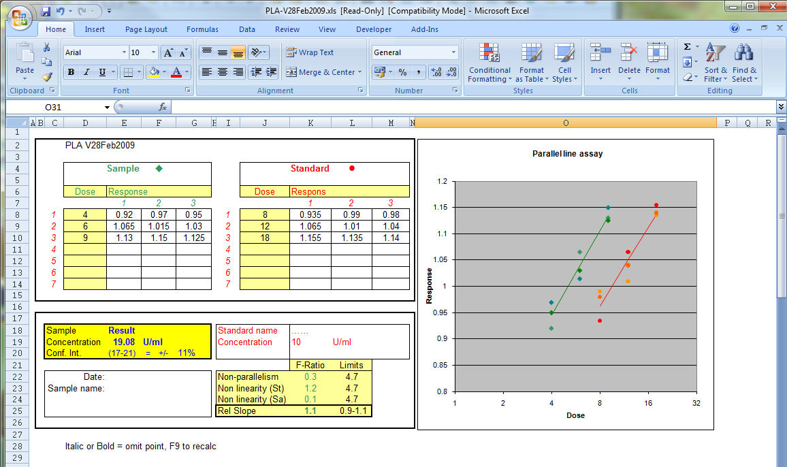
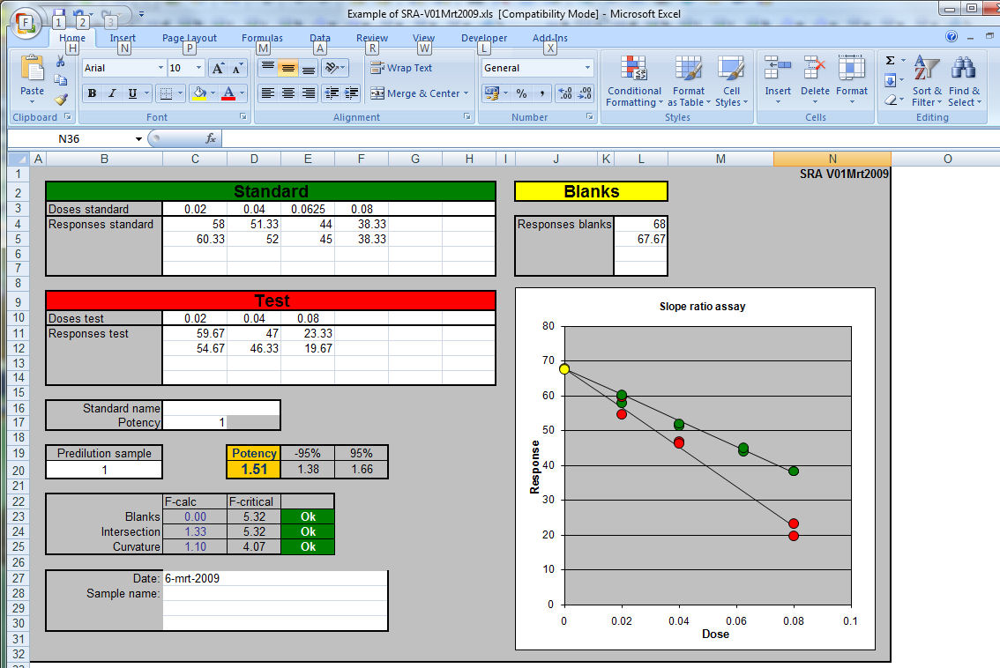
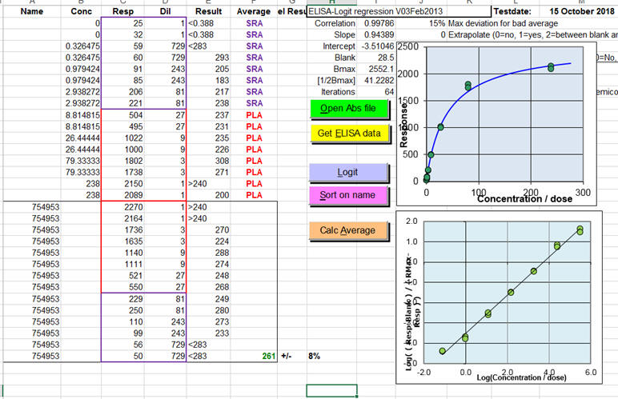
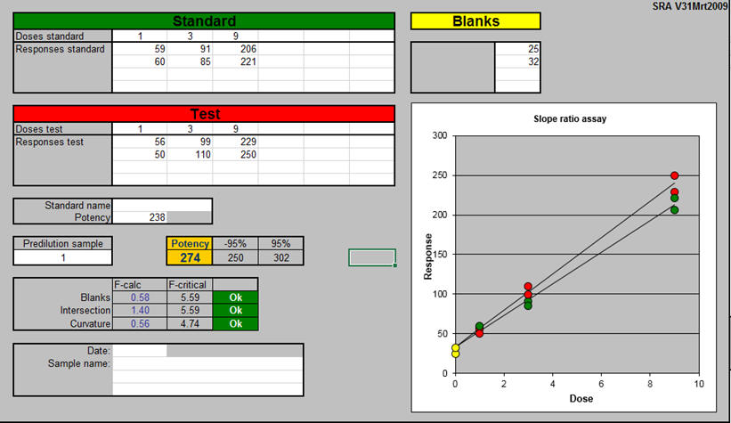
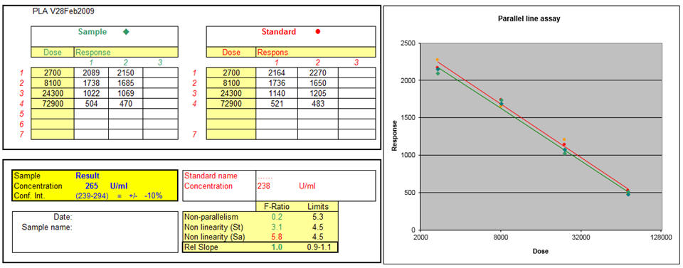

# Logit, SRA and PLA Microsoft Excel calibration programs for the laboratory

Regressions in Excel for calibration: Logit / Rodbard, SRA and PLA.

## Logit, 4-parameter or Rodbard regression

This logit regression program in Excel is optimised to work with RIA and ELISA-data.
The program can be used for fitting all sigmoid and half-sigmoid curves and even a straight line.

➡ [Logit, 4-parameter or Rodbard regression](Logit/README.md)

## Parallel line assay (PLA)

The PLA presented here is written in Microsoft Excel and is a copy of the method described by D.J. Finney.
Up to thirteen samples can be calculated by hand, from an ELISA plate reading or list of responses.

➡ [Parallel line assay PLA](PLA/README.md)

## Slope ratio assay (SRA)

The SRA presented here is written in Microsoft Excel and is a copy of the method described by D.J. Finney.

➡ [Slope ratio assay SRA](SRA/README.md)

---

[See below what is the 'best' calibration program to use.](#what-calibration-program-is-the-best-to-use)

| Logit | PLA | SRA |
| --- | --- | --- |
|  |  |  |

---

## What calibration program is the best to use?

**SRA, PLA or Logit?**

In the following example the data from an ELISA was fed into the three methods.
The calibration line is entered in the logit regression program.
The data pairs that were suitable to be entered in the SRA are marked purple and the dose-responses that could be used in the PLA are coloured red in the picture below.
For the SRA and PLA only those parts that are linear after transformation can be used, resulting in a smaller measuring range that can be entered.

The results for the sample were calculated in:

- PLA as 265 ± 10%
- SRA as 274 ± 10%
- Logit as 261 ± 8%

### My conclusions

As to be expected the calculation method has no great influence on the result.
All results fall well within the confidence limits of the three methods.

**Benefits Logit**

The measuring range is large.
The rejection on SD of the calculated result is based on historical data.

**Cons Logit**

Does not test directly whether the sample dilutes parallel with the standard.
Because of the long measuring range one should be careful with the [hook effect or prozone effect](https://en.wikipedia.org/wiki/Hook_effect).
NB both cons will be noted because the average will have a bad standard deviation and be flagged.

**Benefits PLA**

Robust accepted calculation method with descriptive statistics.

**Disadvantages PLA**

Relatively small measuring area.
The statistics is based on F-tests; when a standard has perfect duplicates all sample results become invalid.
In practice this results in a rejection of a complete test every now and then because the calibration line was so perfect by accident. And also the other way round: bad standard lines give valid results with large confidence intervals.

**SRA benefits**

Suitable for low concentrations and activity measurements.

**Cons SRA**

Often very small measuring range because the dose is linear.
The statistics is based on F-tests and not on historical performances of the test.

### Final conclusion

My choice to use logit regression as first option is its simplicity and long measuring range. It is simple in its rejection criteria and it is easier to use in LIMS systems.
SRA and PLA are a better choice if linearity is an issue.

---

## HP41-C programs

I started learning programming on a HP-9715 desktop calculator at my laboratory at the end of the 1970's.
When the HP41C handheld calculator arrived on the market the same RPN programming language was used and programming continued at home.
I made several programs and sent them to the HP "Users' program library Europe" so they could be used by everyone.
Unfortunately this library is lost. I retained a copy of most of my listings.
These have been scanned and they are available for reference and their formulas.

If time comes I may add more. More in [The museum of HP calculators](http://www.hpmuseum.org/).

➡ [Listing of files](HP41Cprograms)

---

November 2009 - 2026
