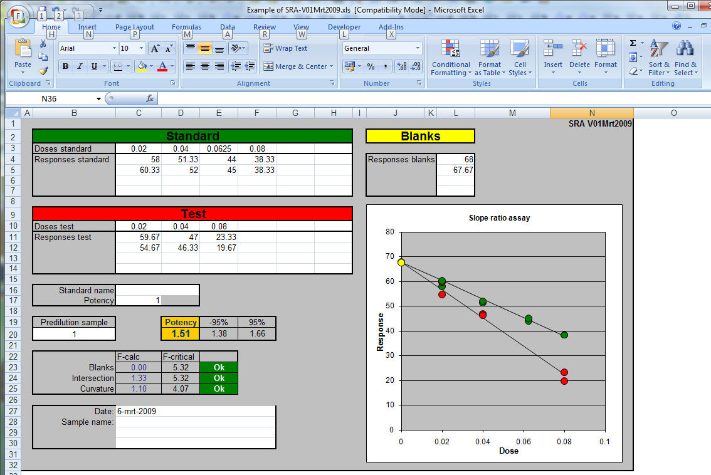

### Regressions Excel calibration Logit / Rodbard, SRA and PLA

<h1>Three Microsoft Excel calibration programs for the laboratory</h1>

This
      logit regression program in Excel is optimised to work with RIA and ELISA-data.  
The program can be used for fitting all sigmoid and half-sigmoid curves and even
a straight line. 
    <a href="Logit/Logit.htm">Logit,
  4-parameter or Rodbard regression</a>

The
      PLA presented here is written in Microsoft Excel and is an copy of the
  method described by D.J. Finney. 
  Up to thirteen samples can be calculated by hand, from an ELISA plate reading or list of responses.  
  <a href="PLA/PLA.htm">Parallel
  line assay PLA  </a>

The
      SRA presented here is written in Microsoft Excel and is an copy of the
  method described by D.J. Finney. 
<a href="SRA/SRA.htm">Slope ratio assay SRA</a>

	

	<a href="#What_calibration_program_is_the_best_to_use">See below what is the 
	'best' calibration program to use.</a>

<table border="0" width="1024">
  <tr>
    <td width="1018" height="31" class="auto-style9" style="width: -1018">Logit</td>
    <td height="31" class="auto-style9" style="width: 97px">&nbsp;&nbsp;&nbsp;&nbsp;&nbsp;&nbsp;&nbsp;&nbsp;&nbsp;&nbsp;&nbsp; 
	PLA</td>
    <td width="1018" height="31" class="auto-style9" style="width: 339px">SRA</td>
  </tr>
  <tr>
    <td width="1018" height="31" style="width: -1018"></td>
    <td height="31" style="width: 97px">
	</td>
    <td width="1018" height="31" style="width: 339px">
	</td>
  </tr>
</table>

<strong>
<a name="What_calibration_program_is_the_best_to_use">What calibration program 
is the best to use?</a></strong>

	

	SRA, PLA or Logit?

	
In following example the data from an ELISA was fed 
	into the three methods. The calibration line is entered in the logit 
	regression program.  The data pairs that were suitable to be entered in 
	the SRA are marked purple and the dose-responses that could be used in the 
	PLA are coloured red in the picture below. For the SRA and PLA only those 
	parts that are linear after transformation can be used resulting is a 
	smaller measuring range that can be entered.

	

	

	

	
The results for the sample were calculated in: PLA 
	as 265 ± 10% SRA as 274 ± 10% Logit as 261 ± 8% 

	
My conclusions:

	
As to be expected the calculation method has no great 
	influence on the result.  All results fall well within in the&nbsp; 
	confidence limits of the three methods.   
	Benefits Logit The measuring range is 
	large.  The rejection on SD of calculated result is based on historical 
	data. Cons Logit Does not test 
	directly whether sample dilutes parallel with the standard.  Because of 
	the long measuring range one should be careful with the
	<a href="https://en.wikipedia.org/wiki/Hook_effect">hook effect or prozone 
	effect</a>. NB both cons will be noted because the average will have a 
	bad standard deviation and be flagged)   
	Benefits PLA Robust accepted calculation method with descriptive 
	statistics. Disadvantages PLA 
	Relatively small measuring area.  The statistics is based on F-tests; 
	when a standard has perfect duplicates all sample results becomes invalid. 
	In practice this results is a rejection of a complete test so now and then 
	because the calibration line was so perfect by accident. And also the other 
	way round. Bad standard lines give valid results with large confidence 
	intervals.  SRA benefits Suitable 
	for low concentrations and activity measurements. 
	Cons SRA Often very small measuring 
	range because the dose is linear. The statistics is based on F-tests and 
	not on historical performances of the test.

	
Final conclusion 
	My choice to use logit regression as first option is its simplicity and long 
	measuring range. It is simple in its rejection criteria and it is easier to 
	use in LIMS systems. SRA and PLA are a better choice if linearity is an 
	issue. 

	
&nbsp;

<strong>HP41-C programs </strong>

I started learning programming
    on a HP-9715 desktop calculator at my laboratory in the end of the 1970's.  
  When the HP41C handheld calculator arrived on the market the same programming
  RPN-language was used and programming continued at home. 
  I made several programs and send them to the HP &quot;Users' program library
  Europe&quot; so
  they could be used by everyone.  
  Unfortunately this library is lost.
  I retained a copy of most of my listings. 
  These have been 
  scanned and they are available for reference and their formulas.

If time comes I may
    add more. More in <a href="http://www.hpmuseum.org/">The museum of HP calculators</a> 

<a href="HP41Cprograms/">Listing of files</a> 

	
&nbsp;

	
&nbsp;

November 2009 - 2021

<a href="../index.html">&lt; --------
  Back home</a> 

Ed Nieuwenhuys <a href="../email.html">Email</a> 

