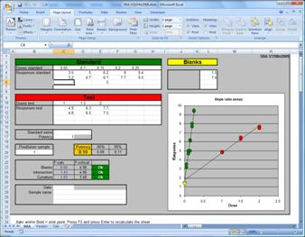
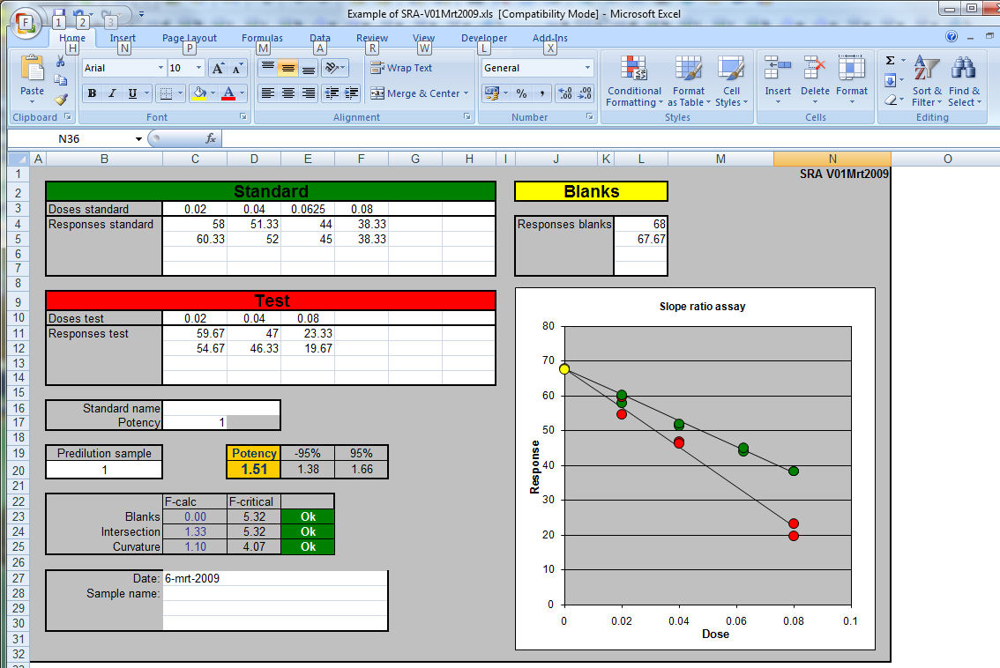

### Slope ratio assay, SRA
<h1 align=center style='text-align:center; font-family: Verdana, Arial, Helvetica, sans-serif;'>
Slope Ratio assay (SRA)</h1>
<table width="1024" border="0" cellspacing="1" cellpadding="5">
  <tr>
    <td width="559">
<a href="../Regression.htm">&lt;-- Back to 
	calibration programs</a>

      
In a slope ratio assay the responses of dilutions of a 
	  standard are compared with the responses of dilutions of a test sample. 
      The doses (dilutions) are linear distributed, this in contrast with the 
	  parallel line assay (PLA) where the logarithm of the doses is linear 
	  distributed. 
      With the SRA the lines of the standard and sample must intersect at the 
	  reponse of the blank.  
      A linear line is calculated through the dose-response points for the 
	  standard with the equation: 
      Response = Sa * dosis + intercept  
      And for the test sample as: 
	  Response = Ta * dosis + intercept&nbsp;&nbsp; 

      
The two lines have an intersection point at dosis = 0 — 
	  the intercept is identical in both equations. 
      The ratio of Sa/Ta is used to calculate the potency of the test sample. 
	  SRA if often used in reaction rate test where the measuring intervals are 
	  close together at the start of the reaction. D.J. Finney was one of the 
	  first mathematicians who described SRA in detail.
</td>
    <td width="442">
 
            
</td>
  </tr>
  <tr>
    <td colspan="2">
The SRA presented here is written in 
	Microsoft Excel and is an copy of the method described by D.J. Finney 
	 Two versions are available. Version 1 march 2009 uses no Visual basic 
	macro's but in this version one can not see what responses are omitted. 
      In version 31 march 2009 a Visual Basic macro tests if responses are in 
	italic and/or bold and does not use these marked entries. The advantage is 
	obvious; one can see the deleted entries and one can include or exclude 
	points in the calculation easily by marking them. 
    Excel does not recalculate a sheet when a font is changed. Therefore one has 
	to force a recalculation by pressing F2 followed by Enter. 

    </td>
  </tr>
  <tr class="MsoTableGrid">
    <td valign=top style='width:239.3pt; border:solid black 1.0pt; border-top:none; padding:0cm 5.4pt 0cm 5.4pt; font-family: Verdana, Arial, Helvetica, sans-serif;'>
      
<a href="SRA-V01Mrt2009.zip">
	  Download SRA without visual basic</a> V01mrt2019
</td>
    <td valign=top style='width:222.8pt; border-top:none; border-left: none; border-bottom:solid black 1.0pt; border-right:solid black 1.0pt; padding:0cm 5.4pt 0cm 5.4pt; font-family: Verdana, Arial, Helvetica, sans-serif;'>
      
<a href="SRA-V31Mrt2009.zip">
	  Download SRA with Visual basic</a> V31mrt2019
</td>
  </tr>
  <tr class="MsoTableGrid">
    <td valign=top style='border-left: 1.0pt solid black; border-right: 1.0pt solid black; border-bottom: 1.0pt solid black; padding: 0cm 5.4pt; font-family: Verdana, Arial, Helvetica, sans-serif; height: 38px; border-top-style: none; border-top-color: inherit; border-top-width: medium;' colspan="2">
      The latest version has the possibility to enter 6 responses instead of 4. 
	  <a href="SRA6x6%20V16Aug2021.zip">SRA6x6 V16Aug2021</a></td>
  </tr>
  <tr>
    <td colspan="2" style="height: 13px"></td>
  </tr>
  <tr>
    <td colspan="2">The use of the program is straight 
	forward. 
	 Enter the doses and at least two responses of the sample, the standard 
	and the blanks of the test.  
    The calculated slope is multiplied by predilution and by the calculated 
	potency of the standard. The three F-tests are used to validate the test 
	Blank is to test if the calculated slope intersects with the mean of the 
	blanks 
    Intercept tests if the standard and the sample lines intersect at dosis is 
	zero. 
    curvature test if the line are straight and not curved. 
    If one of these F-tests is greater than the F-critical the calculated 
	potency must be rejected. </td>
  </tr>
</table>

&nbsp;

Reference: "Statistical Methods in Biological 
Assays"&nbsp; D.J.Finney , Third edition 1978,
<a href="Finney-SRA.pdf">pag 148-166</a>

<a href="../Regression.htm">&lt;-- Back to calibration programs</a> 

<a href="../../email.html">Ed Nieuwenhuys</a>, 
10 may 2022, 16 august 2021, 9 july 2009  

