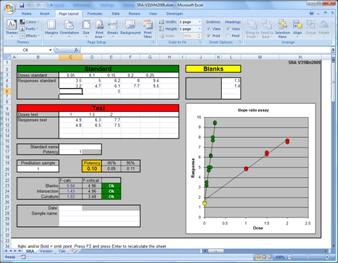

# Slope Ratio Assay (SRA)

[⬅ Back to calibration programs](../README.md)



In a slope ratio assay the responses of dilutions of a standard are compared with the responses of dilutions of a test sample.
The doses (dilutions) are linear distributed, this in contrast with the parallel line assay (PLA) where the logarithm of the doses is linear distributed.
With the SRA the lines of the standard and sample must intersect at the response of the blank.
A linear line is calculated through the dose-response points for the standard with the equation:

```
Response = Sa * dosis + intercept
```

And for the test sample as:

```
Response = Ta * dosis + intercept
```

The two lines have an intersection point at dosis = 0 — the intercept is identical in both equations.
The ratio of Sa/Ta is used to calculate the potency of the test sample. SRA is often used in reaction rate tests where the measuring intervals are close together at the start of the reaction. D.J. Finney was one of the first mathematicians who described SRA in detail.

## Versions

The SRA presented here is written in Microsoft Excel and is a copy of the method described by D.J. Finney.
Two versions are available.
Version 1 march 2009 uses no Visual Basic macro's, but in this version one can not see what responses are omitted.
In version 31 march 2009 a Visual Basic macro tests if responses are in italic and/or bold and does not use these marked entries. The advantage is obvious: one can see the deleted entries and one can include or exclude points in the calculation easily by marking them.
Excel does not recalculate a sheet when a font is changed. Therefore one has to force a recalculation by pressing F2 followed by Enter.

| File | Description |
| --- | --- |
| [Download SRA without Visual Basic](SRA-V01Mrt2009.zip) | V01mrt2019 |
| [Download SRA with Visual Basic](SRA-V31Mrt2009.zip) | V31mrt2019 |
| [SRA6x6 V16Aug2021](SRA6x6%20V16Aug2021.zip) | The latest version, with the possibility to enter 6 responses instead of 4 |

## Use of the program

The use of the program is straight forward.
Enter the doses and at least two responses of the sample, the standard and the blanks of the test.
The calculated slope is multiplied by predilution and by the calculated potency of the standard. The three F-tests are used to validate the test:

- **Blank** tests if the calculated slope intersects with the mean of the blanks.
- **Intercept** tests if the standard and the sample lines intersect at dosis is zero.
- **Curvature** tests if the lines are straight and not curved.

If one of these F-tests is greater than the F-critical, the calculated potency must be rejected.


---

Reference: *Statistical Methods in Biological Assays*, D.J. Finney, Third edition 1978, [pag 148-166](Finney-SRA.pdf)

[⬅ Back to calibration programs](../README.md)

---

[Ed Nieuwenhuys](https://ednieuw.com/email.html), 10 May 2022, 16 August 2021, 9 July 2009
